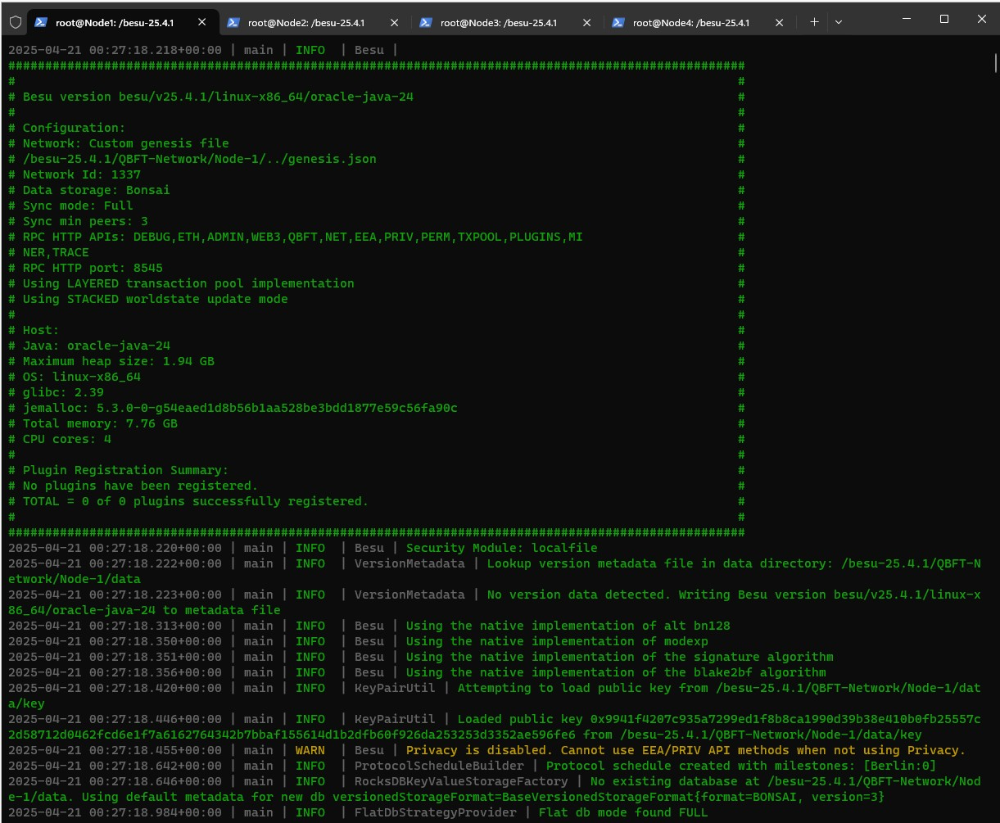
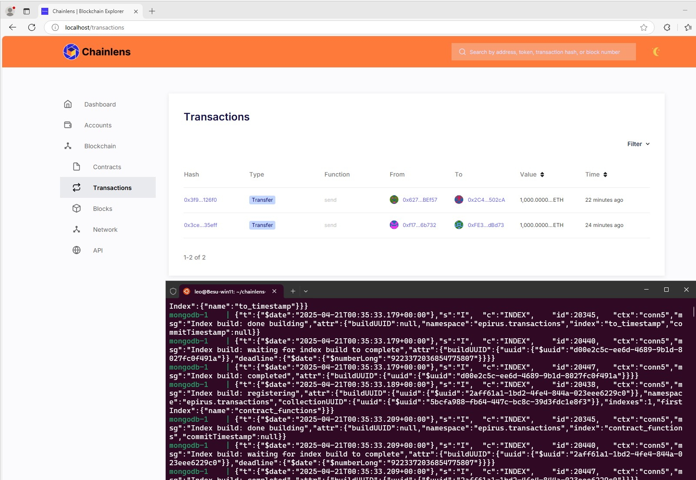
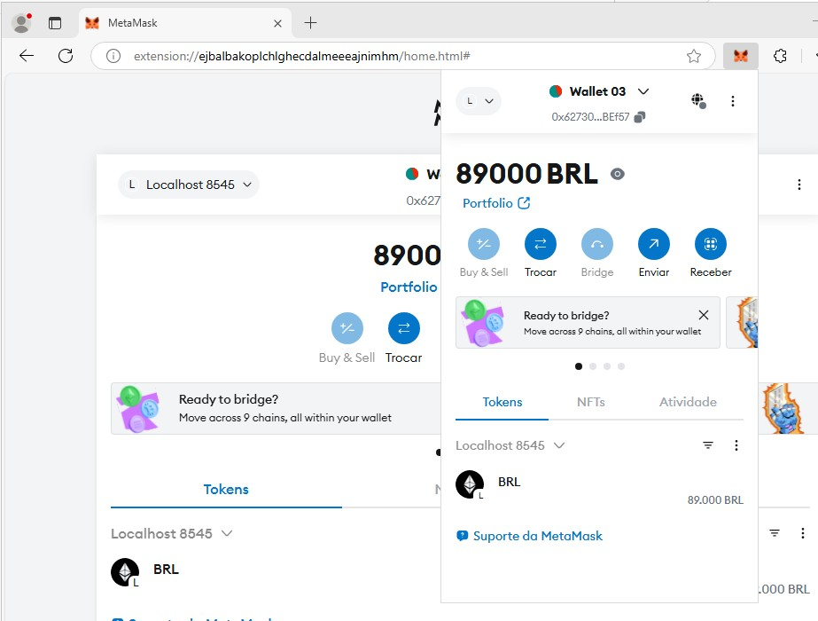

# BesuQBFT
Esse é o laboratório para estruturar o ambiente do [Hyperledger BESU](https://github.com/hyperledger/besu/releases) (versão 25.4.1), na configuração padrão, para servir de base para o Challenge dos alunos da FIAP, do curso de Tecnologia de Defesa Cibernética (TDC).<br />
Instalação de uma rede Hyperledger BESU com 4 nodes (1 Bootloader e 3 Nodes participantes), protocolo Quorum Byzantine Fault Tolerance ([QBFT](https://docs.goquorum.consensys.io/configure-and-manage/configure/consensus-protocols/qbft)) e o explorador de blocos Chainless para acompanhamento das transações. <br />
Esse laboratório não possui nenhuma recomendação ou dica que possa ser usada como vantagem competitiva entre os grupos. Apenas a estrutura básica para que o blockchain seja montado. <br />
Ele foi montado em uma VM na Azure, tipo D4ads_v6 em West Central US, atrelado à uma VNet com NSG e ASG configurado para permitir as ports de gerenciamento e as usadas pelo BESU. <br />
Novo no Blockchain? Assista à este vídeo abaixo...<br />
<a href="https://www.youtube.com/watch?v=6e4Q_hzTv90" target="_blank">
  
</a>
## Pré Requisitos
✅ Windows 11 <br />
✅ Virtualização habilitada <br />
✅ [Windows Subsystem for Linux](https://docs.microsoft.com/pt-br/windows/wsl/install) (WSL) instalado <br />
    ```wsl --install```<br />
    ```wsl --list --online ```<br />
    ```wsl --install -d Ubuntu-24.04 ```<br />
    ```wsl --list --verbose  ```<br />
    ```wsl --update```<br />

✅ [Git](https://git-scm.com/download/win) e [Visual Studio Code](https://code.visualstudio.com/download) instalados<br />
✅ [Ubuntu para WSL](https://apps.microsoft.com/detail/9nz3klhxdjp5?hl=en-US&gl=US) instalado<br />
✅ [Docker e Docker Compose](https://www.docker.com/products/docker-desktop/) instalados<br />
✅ Conta ativada no Github<br />
✅ Instale o [MetaMask](https://microsoftedge.microsoft.com/addons/detail/metamask/ejbalbakoplchlghecdalmeeeajnimhm) ou acesse a partir do seu navegador - Exemplo no Microsoft Edge<br />
✅ Atualizaçao de pacotes do Azure CLI e Terminal <br />
    ```winget install --id Microsoft.PowerShell.Preview --source winget```<br />
    ```winget install --exact --id Microsoft.AzureCLI```<br />

✅ Fork do código no Github<br />
    ```git clone https://github.com/corsec00/BesuQBFT.git```    
## Instalação do Hyperledger BESU
A partir do diretório onde o repositório foi baixado, execute o seguinte comando para construir o HL Besu no Docker.<br />
``` docker build -t besu:fiaptdc .```<br />
Uma vez instalado, use o script ```.\start_demo.ps1``` para subir os nós (1 Ordering Service, 2 nós com o mínimo de 3 peers para um consenso)<p>
Para cada um dos terminais abertos, execute o comando ```.\nxup.sh```, onde ```x``` é o número do node:<br />
```.\n1up.sh``` no node-1<br />
Aguarde o Node-1 gerar o endereço enode (exemplo: *main | INFO  | DefaultP2PNetwork | Enode URL enode://7c88a36ff20962757b88fdece745d0875d52943cc13978d78507eb468a0b016d53a04fcdbcaf8ab03f17e7daf234ad1251a4c153a79a2edf15c88efb357b35a7@10.10.0.11:30303*) e a partir de então, suba os outros nodes.<br />
```.\n2up.sh``` no node-2<br />
```.\n3up.sh``` no node-3<br />
```.\n4up.sh``` no node-4<br />
Quando vc receber uma mensagem parecida com *BftProcessorExecutor-QBFT-0 | INFO  | QbftRound | Importing proposed block to chain. round=ConsensusRoundIdentifier{Sequence=1, Round=4}, hash=0x026651f099ff71bcbc89c3e4a18a50e8e1ba2c438f274b7897781b0ad2a1c6ab*, significa que os 4 nodes estão prontos e que os blocos começaram o processo de mineração na blockchain do Besu<br />

## Configurar o Chainless Block Explorer
O [Chainless](https://besu.hyperledger.org/private-networks/how-to/monitor/chainlens) será usado para acompanhar a situação dos blocos e a estrutura das transações do BESU.<br />
Em um terminal WSL2 rodando **Ubuntu**, clone o repositório da Chainless.<br />
```git clone https://github.com/web3labs/chainlens-free```<br />
Entre na pasta com os arquivos da Chainless.<br />
```cd chainlens-free/docker-compose/```<br />
Procure o arquivo `docker-compose.yml` disponível na pasta onde estão os arquivos do BESU e substitua pelo arquivo que está em: `chainlens-free/docker-compose/`.<br />
Execute o script de inicialização do ambiente da Chainless:<br />
    ```NODE_ENDPOINT=http://10.10.0.11:8545 docker-compose up```<br />
    Acesse http://localhost para navegar no Chainless.<br />

## Configurar MetaMask
Adicione a rede_besu na MetaMask como uma rede de teste:<br />
    Network Name =     `Localhost 8545`<br />
    RPC URL =          `http://localhost:8545`<br />
    ChainID =          `1337` (definido no arquivo Genesis)<br />
    Currency Symbol =  `BRL`<br />
    Block Explorer =   `http://localhost/`<br />

Chaves privadas definidas no arquivo genesis da rede devem ser importadas para Metamask <br />
    - Account 2: ```0x8f2a55949038a9610f50fb23b5883af3b4ecb3c3bb792cbcefbd1542c692be63```<br />
    - Account 3: ```0xc87509a1c067bbde78beb793e6fa76530b6382a4c0241e5e4a9ec0a0f44dc0d3    ```<br />
    - Account 4: ```0xae6ae8e5ccbfb04590405997ee2d52d2b330726137b875053c36d94e974d162f```<br />

Selecione a rede `Localhost 8545` na MetaMask.
Em caso de dúvidas, consulte a [Documentação Oficial](https://besu.hyperledger.org/private-networks/tutorials/quickstart#create-a-transaction-using-metamask)<br />
Realize transações entre as contas e veja no Chainless os resultados.<br />

## Considerações Finais
Este laboratório foi inspirado no trabalho de [Alexandre Gomes](https://github.com/alexandregomes3112)
